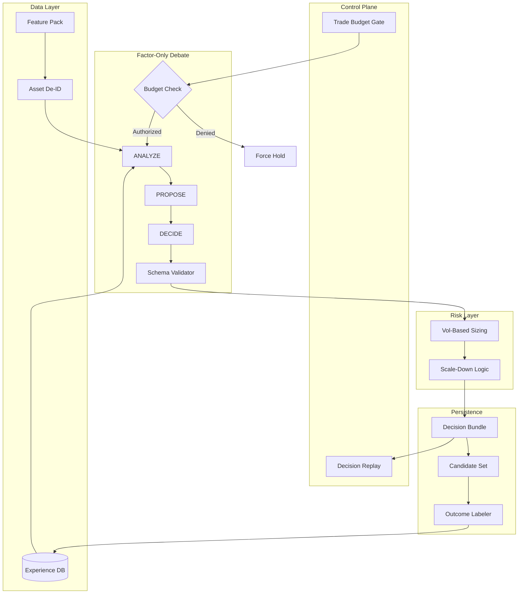

# AI Fund Production Fixes v2 (Control + Observability)

## What's Actually Wrong

Your backtest has solid bones but invalid results:

1. **Trade frequency broken** - "3/week" checked AFTER LLM decides (failure mode #1)
2. **No control plane** - Can't replay decisions, can't enforce constraints deterministically
3. **Temporal leakage** - LLM knows AAPL becomes trillion-dollar company
4. **Narrative reasoning** - "Disney brand strong" instead of factors
5. **Risk manager overkill** - Mean reversion made zero trades
6. **No training data** - Missing feature vectors + candidate sets
7. **Toy evaluation** - No alpha, turnover cost, regime analysis
8. **No learning** - Doesn't use past trades

---

## Fix 0: Trade Frequency Control Plane (Kill the Bug)

### Current bug: Failure Mode #1

In [simulation_engine.py:83-204](python/core/backtest/simulation_engine.py):

```python
MAX_TRADES_PER_WEEK = 3

def _should_skip_decision(self, fund_id: str, current_date: date) -> bool:
    recent_trades = len([t for t in self.trades if ...])
    trades_remaining = max(0, self.MAX_TRADES_PER_WEEK - recent_trades)
    return trades_remaining == 0
```

**The flow is broken:**

1. LLM proposes trade
2. Debate happens (costs tokens)
3. Orders created
4. "Oops, too many trades" → reject

You've already spent money and logged a useless decision.

### The fix: TradeBudget gate BEFORE LLM

```python
@dataclass
class TradeBudget:
    """
    Authoritative trade budget - gates action space BEFORE proposals.
    
    Makes violations impossible.
    """
    fund_id: str
    current_date: date
    portfolio_value: float
    
    # Weekly budget
    trades_this_week: int = 0
    max_trades_per_week: int = 3
    
    # Rebalance schedule (code, not vibes)
    rebalance_cadence: str = "weekly"  # "daily", "weekly", "monthly"
    last_rebalance_date: Optional[date] = None
    next_rebalance_date: Optional[date] = None
    
    # Hysteresis (prevent micro-adjustments)
    min_weight_delta: float = 0.02  # 2% minimum change
    min_order_notional: float = 1000.0  # $1k minimum
    
    # Cooldown
    cooldown_until: Optional[date] = None
    
    def can_buy(self) -> bool:
        """Can we buy? Checked BEFORE LLM proposal."""
        if self.cooldown_until and self.current_date < self.cooldown_until:
            return False
        if self.trades_this_week >= self.max_trades_per_week:
            return False
        if not self._is_rebalance_day():
            return False
        return True
    
    def can_sell(self) -> bool:
        """Can we sell? (always yes, even in cooldown)"""
        return True
    
    def _is_rebalance_day(self) -> bool:
        """Is today a rebalance day? (deterministic, not LLM's choice)"""
        if self.rebalance_cadence == "daily":
            return True
        if self.rebalance_cadence == "weekly":
            # Monday or 5 trading days since last rebalance
            return (self.current_date - self.last_rebalance_date).days >= 5
        if self.rebalance_cadence == "monthly":
            return (self.current_date - self.last_rebalance_date).days >= 20
        return False
    
    def should_trade(
        self,
        current_weight: float,
        target_weight: float,
        price: float
    ) -> bool:
        """Hysteresis check - only trade if change is meaningful."""
        delta = abs(target_weight - current_weight)
        
        # Too small to matter
        if delta < self.min_weight_delta:
            return False
        
        # Check notional
        notional = delta * self.portfolio_value
        if notional < self.min_order_notional:
            return False
        
        return True
    
    def consume_trade_event(self) -> None:
        """Consume one rebalance event (multiple orders = 1 event)."""
        self.trades_this_week += 1
        self.last_rebalance_date = self.current_date
    
    def to_context_string(self) -> str:
        """Format for LLM prompt."""
        return f"""TRADE BUDGET:
- Trades this week: {self.trades_this_week}/{self.max_trades_per_week}
- Buy authority: {"AUTHORIZED" if self.can_buy() else "DENIED (budget/schedule)"}
- Sell authority: AUTHORIZED (always)
- Rebalance window: {"OPEN" if self._is_rebalance_day() else f"CLOSED until {self.next_rebalance_date}"}
- Cooldown: {"NONE" if not self.cooldown_until else f"ACTIVE until {self.cooldown_until}"}

CONSTRAINTS:
- Minimum weight delta: {self.min_weight_delta:.1%}
- Minimum order size: ${self.min_order_notional:,.0f}
"""
```

### New enforcement flow

```
1. Build TradeBudget
2. IF budget.can_buy() == False:
     Force action_space = {hold, sell_only}
     Don't even ask LLM about buys
3. Pass budget to LLM context
4. LLM proposes decision
5. Validator: if action=buy AND not budget.can_buy() → HARD REJECT
6. If action passes: budget.consume_trade_event()
7. Create orders (with hysteresis filter)
```

### Count "rebalance events" not orders

If you buy 3 stocks and sell 2 on the same day → **1 trade event**.

```python
def count_rebalance_events(self, start_date: date, end_date: date) -> int:
    """
    Count rebalance events (trading days), not individual orders.
    """
    trading_days_with_activity = set()
    for order in self.orders:
        if start_date <= order.date <= end_date:
            trading_days_with_activity.add(order.date)
    return len(trading_days_with_activity)
```

### Files to modify

- New file: `python/core/execution/trade_budget.py` - TradeBudget class
- [python/core/backtest/simulation_engine.py](python/core/backtest/simulation_engine.py) - Build budget before debate, enforce deterministically
- [python/core/backtest/debate_runner.py](python/core/backtest/debate_runner.py) - Pass budget to context
- [python/core/langchain/schemas.py](python/core/langchain/schemas.py) - Validate against budget
- [python/core/funds/fund.py](python/core/funds/fund.py) - Remove `max_turnover_daily` (replaced by budget), codify `rebalance_cadence`

---

## Fix 1: Decision Replay Debugger (Observability)

### The problem

Right now, when a trade looks weird, you have to:

1. Read logs manually
2. Guess what the LLM saw
3. Can't replay to test fixes
4. No diff between runs

You need **step-through debugging for AI decisions**.

### The solution: Decision Bundle API

```python
@dataclass
class DecisionBundle:
    """
    Complete decision state - everything needed to replay/debug.
    """
    # Core
    decision_id: str
    run_id: str
    fund_id: str
    timestamp: datetime
    simulation_day: int  # "Day 42" not actual date
    
    # State before decision
    portfolio_before: Dict[str, Any]  # positions, cash, exposure
    risk_state: Dict[str, Any]  # cooldown, circuit breakers
    trade_budget: Dict[str, Any]  # budget state
    
    # Candidates
    candidate_set: List[Dict[str, Any]]  # All assets considered
    selected_asset_id: Optional[str]
    
    # Agent debate
    agent_messages: List[Dict[str, Any]]  # phase, model, content, tokens
    
    # Validation
    validation_result: Dict[str, Any]  # pass/fail, violations
    risk_check_result: Dict[str, Any]  # vetoes, scaling
    
    # Execution
    orders_created: List[Dict[str, Any]]
    orders_filled: List[Dict[str, Any]]
    
    # Outcome (filled post-hoc)
    outcome_1d: Optional[float] = None
    outcome_5d: Optional[float] = None
    outcome_21d: Optional[float] = None
    realized_pnl: Optional[float] = None
    
    # State after decision
    portfolio_after: Dict[str, Any]
```

### CLI / API endpoints

```python
# List decisions with filters
decisions = list_decisions(
    run_id="backtest_2000_2025",
    fund_id="momentum_fund",
    date_range=("2000-01-01", "2000-02-01"),
    action="buy",  # filter by action
    rejected=True,  # show rejected decisions
)

# Get full bundle
bundle = get_decision_bundle("decision_abc123")

# Replay with overrides
replay_result = replay_decision(
    decision_id="decision_abc123",
    overrides={
        "temperature": 0.3,  # Lower temp
        "top_k_candidates": 5,  # Fewer candidates
        "min_momentum_rank": 0.90  # Stricter filter
    }
)

# Diff two decisions
diff = diff_decisions(
    original="decision_abc123",
    replay="decision_xyz789"
)
# Returns: what changed in agent outputs, orders, outcomes
```

### Minimal UI (optional)

Don't need React. A simple Flask page works:

```
/backtest/decisions?run_id=xxx&fund_id=yyy

Shows table:
| Day | Fund | Action | Asset | Weight | Validation | Risk Check | Outcome |
|-----|------|--------|-------|--------|------------|------------|---------|
| 42  | Mom  | buy    | Asset_003 | 12% | PASS | scaled→10% | +5.2% |
| 43  | Mean | buy    | Asset_007 | 8%  | REJECT | no budget | N/A |

Click row → Full bundle view:
- Agent debate transcript
- Candidate features
- Validation violations
- Risk check details
- Replay button
```

### Files to modify

- New file: `python/core/backtest/replay.py` - DecisionBundle + replay logic
- New file: `python/api/routes/backtest_replay.py` - API endpoints
- [python/core/backtest/persistence.py](python/core/backtest/persistence.py) - Save full bundles
- [python/db/models.py](python/db/models.py) - Add decision_bundles table

---

## Fix 2: Kill Temporal Leakage (De-identification + Validation)

### Why "remove dates" doesn't work

Even saying "Day 1," the LLM sees:

- Tickers: AAPL, TSLA
- Sectors: "Technology"
- Context: "SPY-era US large cap"

It has priors. It will cheat.

### Real fix: De-identify tickers only

```python
# Mapping (kept in simulator, hidden from LLM)
deidentifier = AssetDeidentifier()
deidentifier.add_mapping("AAPL", "Asset_001")
deidentifier.add_mapping("DIS", "Asset_042")

# What LLM sees
{
    "asset_id": "Asset_001",
    "sector": "Technology",  # Keep readable for controls
    "features": {
        "return_252d": 0.42,
        "return_21d": -0.05,
        "rsi_14": 61.2,
        "z_score_20d": -1.3,
        "volatility_21d": 0.28,
        "momentum_rank_pct": 0.85,  # Cross-sectional rank
        "price": 25.50
    }
}
```

**Why keep sectors readable:**

- Need for sector exposure controls (`max_sector_pct`)
- Debugging and interpretability
- Sectors are less leaky than tickers

### Schema validation + Forbidden tokens

```python
class DecisionValidator:
    """Validate LLM outputs against hard constraints."""
    
    FORBIDDEN_TOKENS = [
        # Tickers
        "AAPL", "MSFT", "GOOG", "AMZN", "TSLA", "META", "NVDA",
        # Products
        "iPhone", "iPad", "Windows", "Model 3", "AWS",
        # Narrative
        "brand", "product launch", "services growth",
        "market leader", "innovation", "disruption"
    ]
    
    def validate(
        self,
        decision: Dict,
        budget: TradeBudget,
        candidates: List[str],
        allowed_features: Set[str]
    ) -> ValidationResult:
        """Hard validation - reject on any violation."""
        
        violations = []
        
        # 1. Budget check
        if decision["action"] == "buy" and not budget.can_buy():
            violations.append("Budget exhausted - buys not authorized")
        
        # 2. Asset in candidate set
        if decision["asset_id"] not in candidates:
            violations.append(f"Asset {decision['asset_id']} not in candidates")
        
        # 3. Weight bounds
        if decision["target_weight"] > self.max_position_pct:
            violations.append(f"Weight {decision['target_weight']:.1%} > max {self.max_position_pct:.1%}")
        
        # 4. Factors in allowlist
        for factor in decision["factors_used"].keys():
            if factor not in allowed_features:
                violations.append(f"Factor '{factor}' not allowed")
        
        # 5. Forbidden tokens in reasoning
        reasoning_lower = decision["reasoning"].lower()
        for token in self.FORBIDDEN_TOKENS:
            if token.lower() in reasoning_lower:
                violations.append(f"Forbidden token: '{token}'")
        
        if violations:
            return ValidationResult(valid=False, violations=violations)
        
        return ValidationResult(valid=True)
```

### Better leakage tests

With LLMs, identical results are impossible. Better tests:

1. **Ticker swap**: Permute Asset_### IDs → decisions change with features only
2. **Holdout narrative**: Same features, different IDs → outputs identical
3. **Forbidden token**: Validator catches any ticker/brand reference

### Files to modify

- New file: `python/core/backtest/deidentifier.py` - AssetDeidentifier
- New file: `python/core/backtest/validator.py` - DecisionValidator
- [python/core/backtest/debate_runner.py](python/core/backtest/debate_runner.py) - De-identify context
- [python/core/langchain/chains.py](python/core/langchain/chains.py) - Factor-only prompts
- [python/core/langchain/schemas.py](python/core/langchain/schemas.py) - Add validation

---

## Fix 3: Risk Manager - Vol-Based + Strategy-Aware

### Current problem: Arbitrary thresholds

Mean reversion fund:

- `min_cash_buffer = 0.10` (10%)
- `max_daily_loss = 0.02` (2%)
- `max_weekly_drawdown = 0.05` (5%)

These are vibes, not grounded in strategy characteristics.

### Real fix: Derive from volatility

```python
# Position sizing (risk parity)
max_position = min(max_pos_cap, risk_budget_per_name / vol_21d)

# Stop loss (tied to expected vol)
stop_loss_pct = 2.0 * expected_daily_vol

# Circuit breakers (strategy-dependent)
max_daily_loss = 2.5 * portfolio_expected_daily_vol
```

### Strategy-specific profiles

**Momentum (12-1 cross-sectional):**

- `max_position_pct = 0.15`
- `min_cash_buffer = 0.05`
- `rebalance_cadence = "monthly"`
- `circuit_breaker_daily = 0.03`
- `circuit_breaker_weekly = 0.07`

**Mean Reversion (short-horizon):**

- `max_position_pct = 0.07` (smaller bets)
- `min_cash_buffer = 0.05` (NOT 0.10!)
- `rebalance_cadence = "daily"`
- `circuit_breaker_daily = 0.025` (tighter)
- `circuit_breaker_weekly = 0.06`

**Value (quality composite):**

- `max_position_pct = 0.10`
- `min_cash_buffer = 0.05`
- `rebalance_cadence = "quarterly"`
- `circuit_breaker_daily = 0.03`
- `circuit_breaker_weekly = 0.08`

### Scale-down, don't veto

```python
if position_weight > max_position_pct:
    scale_factor = max_position_pct / position_weight
    return RiskCheckResult(
        status="scaled",
        scale_factor=scale_factor,
        reason=f"Scaled {position_weight:.1%} → {max_position_pct:.1%}"
    )
```

### Files to modify

- [python/scripts/seed_funds.py](python/scripts/seed_funds.py) - New risk profiles
- [python/core/execution/risk_manager.py](python/core/execution/risk_manager.py) - Vol-based logic
- [python/core/funds/fund.py](python/core/funds/fund.py) - Add vol targeting

---

## Fix 4: Mechanical Fund Theses (No Vibes)

### Current theses are narrative

> "Exploit overreactions in liquid names. Microstructure signals."

This is useless. No thresholds, no rules.

### New mechanical definitions

#### Momentum: "12-1 Cross-Sectional"

```python
{
    "name": "Momentum Cross-Sectional",
    "strategy": "momentum",
    "rules": {
        "signal": "12-month return skipping last month",
        "entry": "Top 15% momentum rank",
        "exit": "Falls below 50% rank",
        "sizing": "Inverse vol, cap 15%",
        "rebalance": "Monthly (20 trading days)"
    },
    "factors": ["return_252d", "return_21d", "momentum_rank_pct", "volatility_21d"],
    "horizon_days": [20, 60]
}
```

#### Value: "Quality Value Composite"

```python
{
    "name": "Quality Value",
    "strategy": "value",
    "rules": {
        "signal": "z(earnings_yield) + z(fcf_yield) + z(roic) - z(leverage)",
        "entry": "Top 20% composite score",
        "exit": "Falls below 40% OR holding > 90 days",
        "sizing": "Equal weight, cap 10%, max 25% per sector",
        "rebalance": "Quarterly"
    },
    "factors": ["earnings_yield", "fcf_yield", "roic", "leverage", "value_rank_pct"],
    "horizon_days": [60, 180]
}
```

#### Mean Reversion: "Oversold + Vol Filter"

```python
{
    "name": "Mean Reversion Short-Horizon",
    "strategy": "mean_reversion",
    "rules": {
        "entry": "z_score < -2.0 AND rsi < 30 AND vol_spike < 2.5x",
        "exit": "z_score > -0.5 OR holding >= 10 days",
        "sizing": "Inverse vol, cap 7%",
        "liquidity": "min_adv > 10M",
        "rebalance": "Daily"
    },
    "factors": ["z_score_20d", "rsi_14", "volatility_21d", "vol_spike_ratio"],
    "horizon_days": [1, 10]
}
```

#### Low Vol: "Defensive"

```python
{
    "name": "Defensive Low Volatility",
    "strategy": "low_vol",
    "rules": {
        "signal": "Realized vol rank (lowest = best)",
        "entry": "Bottom 20% vol + profitability > 0",
        "exit": "Vol rank > 40% OR profit < 0",
        "sizing": "Equal weight, cap 10%",
        "rebalance": "Monthly"
    },
    "factors": ["volatility_63d", "vol_rank_pct", "profitability", "beta"],
    "horizon_days": [30, 120]
}
```

### Files to modify

- [python/scripts/seed_funds.py](python/scripts/seed_funds.py) - Replace all theses
- [python/core/langchain/chains.py](python/core/langchain/chains.py) - Strategy prompts
- New file: `python/core/strategies/low_volatility.py`

---

## Fix 5: Feature Logging + Candidate Sets

### What's missing

Current logging:

```python
{
    "signals_snapshot": {
        "momentum": 0.7,
        "combined": 0.4
    }
}
```

You need raw features + all candidates.

### What to log

```python
# decision_candidates table
{
    "decision_id": "...",
    "asset_id": "AAPL",
    "selected": True,
    "features": {
        "return_1d": 0.02,
        "return_21d": 0.15,
        "return_252d": 0.85,
        "volatility_21d": 0.025,
        "rsi_14": 38.5,
        "z_score_20d": -1.8,
        "momentum_rank_pct": 0.82,
        "sector_id": 5
    },
    "scores": {
        "momentum": 0.7,
        "mean_reversion": -0.2
    },
    "target_weight": 0.10
}

# Outcomes (filled post-hoc)
{
    "decision_id": "...",
    "asset_id": "AAPL",
    "outcome_1d": 0.015,
    "outcome_5d": 0.032,
    "outcome_21d": 0.08,
    "realized_pnl": 150.50
}
```

### Files to modify

- [python/db/models.py](python/db/models.py) - Add `BacktestDecisionCandidate`
- [python/core/backtest/persistence.py](python/core/backtest/persistence.py) - Save candidates
- [python/core/backtest/simulation_engine.py](python/core/backtest/simulation_engine.py) - Build feature packs
- New file: `python/core/backtest/outcome_labeler.py` - Post-hoc labeling

---

## Fix 6: Experience Replay (Memory)

### The idea

Before each decision, retrieve similar past trades:

```
Current: Asset_001, momentum_rank=0.85, vol=0.025

Similar past (top 5 by cosine similarity):
1. Day 42: Asset_003, rank=0.87, vol=0.023 → BUY 12% → +8.2% (21d)
2. Day 67: Asset_007, rank=0.82, vol=0.028 → BUY 15% → -2.1% (21d)
3. Day 89: Asset_001, rank=0.84, vol=0.024 → BUY 10% → +5.7% (21d)

Stats: Win rate 67%, Median alpha +4.2%
```

Feed to LLM as context.

### Implementation

```python
class ExperienceMemory:
    def store(self, decision_id: str, features: np.ndarray, outcome_21d: float):
        normalized = self.normalize(features)
        self.db.add(ExperienceRecord(
            decision_id=decision_id,
            feature_vector=normalized.tolist(),
            outcome_21d=outcome_21d
        ))
    
    def retrieve_similar(self, features: np.ndarray, k: int = 5) -> List[Trade]:
        normalized = self.normalize(features)
        # Cosine similarity search
        similar = self.db.query_by_similarity(normalized, k)
        return similar
```

### Files to modify

- [python/db/models.py](python/db/models.py) - Add `ExperienceRecord`
- [python/core/backtest/simulation_engine.py](python/core/backtest/simulation_engine.py) - Query before decision
- [python/core/backtest/debate_runner.py](python/core/backtest/debate_runner.py) - Add to context
- New file: `python/core/ai/experience_memory.py`

---

## Fix 7: Evaluation (Alpha, Regime, Cost)

### Missing metrics

- Alpha vs SPY
- Information ratio
- Turnover cost drag
- Regime-split performance
- PnL attribution

### New calculations

```python
class EnhancedMetrics:
    alpha: float  # Excess return vs SPY
    beta: float
    information_ratio: float
    
    gross_return: float
    net_return: float
    turnover_cost_drag_bps: float
    
    performance_by_regime: Dict[str, float]
    # {"bull_low_vol": {...}, "bear_high_vol": {...}}
    
    pnl_by_fund: Dict[str, float]
    pnl_by_sector: Dict[str, float]
```

### Regime detection

```python
def detect_regime(snapshot) -> str:
    spy_ret = snapshot.get_return("SPY", "21d")
    spy_vol = snapshot.get_volatility("SPY", "21d")
    
    trend = "bull" if spy_ret > 0 else "bear"
    vol = "high" if spy_vol > 0.20 else "low"
    
    return f"{trend}_{vol}"  # "bull_low", "bear_high", etc
```

### Files to modify

- [python/core/evals/metrics.py](python/core/evals/metrics.py) - Add all new metrics
- [python/core/backtest/simulation_engine.py](python/core/backtest/simulation_engine.py) - Track regimes
- [python/core/backtest/persistence.py](python/core/backtest/persistence.py) - Store regime labels

---

## Architecture Diagram




---

## Implementation Order

### Phase 1: Control + Validity (Days 1-2)

1. **TradeBudget gate** - Fix trade frequency bug
2. **Decision replay** - Observability for debugging
3. **De-identification** - Asset_### + forbidden tokens
4. **Schema validation** - Hard rejection of violations
5. **Vol-based risk** - Strategy-aware controls

After this: system is controllable and backtest is valid.

### Phase 2: Learning (Day 3)

1. **Mechanical theses** - Factor-based rules
2. **Feature logging** - Full vectors + candidates
3. **Experience replay** - Memory retrieval

After this: system learns from experience.

### Phase 3: Evaluation (Day 4)

1. **Alpha metrics** - Benchmark-relative
2. **Regime analysis** - Performance by state
3. **Turnover cost** - Real cost accounting

After this: can judge performance properly.

### Phase 4: Data Quality (Later)

1. **Survivorship fix** - Sharadar/QuantConnect
2. **Corporate actions** - Splits/dividends
3. **Point-in-time fundamentals**

---

## Critical Success Tests

After implementation:

1. **Trade frequency**: Run 4-week backtest, see exactly 3 trades/week/fund
2. **Replay test**: Replay any decision, get same LLM output (±temperature noise)
3. **Ticker swap**: Permute Asset IDs, decisions change with features only
4. **Forbidden token**: Validator catches "AAPL" or "iPhone" in reasoning
5. **Mean reversion trades**: Fund makes >0 trades (not stuck in cash)
6. **Feature coverage**: Every decision logs full feature vector
7. **Memory test**: Later decisions reference similar past trades
8. **Alpha calculation**: Shows +/- vs SPY, not just absolute return

If all 8 pass: **production-grade backtest**.

---

## Key Files Summary


| File                                        | Changes                             | Priority |
| ------------------------------------------- | ----------------------------------- | -------- |
| `python/core/execution/trade_budget.py`     | NEW - Budget gate                   | P0       |
| `python/core/backtest/replay.py`            | NEW - Decision debugger             | P0       |
| `python/core/backtest/deidentifier.py`      | NEW - Asset mapping                 | P0       |
| `python/core/backtest/validator.py`         | NEW - Schema validation             | P0       |
| `python/core/backtest/simulation_engine.py` | Enforce budget, remove old limit    | P0       |
| `python/core/backtest/debate_runner.py`     | De-ID context, pass budget          | P0       |
| `python/scripts/seed_funds.py`              | Mechanical theses, risk profiles    | P0       |
| `python/core/execution/risk_manager.py`     | Vol-based sizing                    | P1       |
| `python/db/models.py`                       | Add candidates, bundles, experience | P1       |
| `python/core/ai/experience_memory.py`       | NEW - Memory retrieval              | P1       |
| `python/core/evals/metrics.py`              | Alpha, regime, attribution          | P2       |


