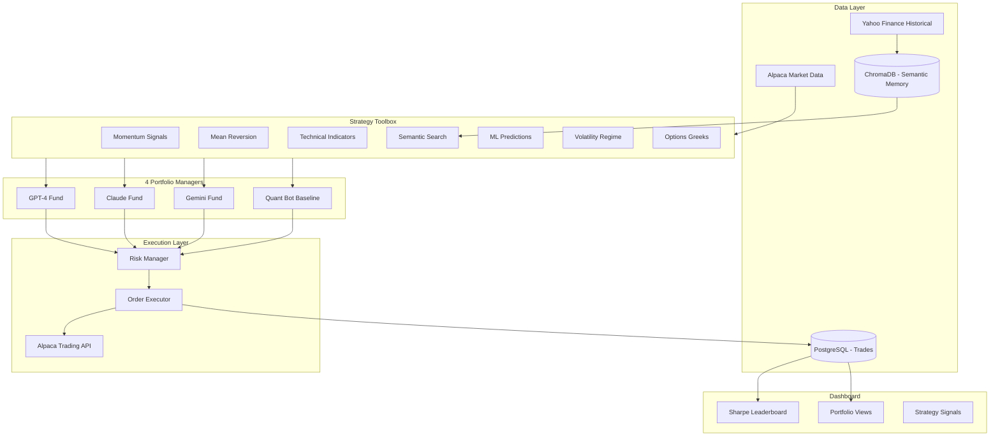

# AI Trading Lab

## Vision

> "Markets are too complex for any single AI approach. We're building the platform where different approaches compete to discover what actually works."

**Core Differentiator**: Semantic Market Memory - AI that remembers what markets *felt* like, not just what prices were.

**Key Question We Answer**: Do LLMs actually add value over systematic quant strategies?

---

## Architecture Overview

```
┌─────────────────────────────────────────────────────────────────────────┐
│                          AI TRADING LAB                                 │
├─────────────────────────────────────────────────────────────────────────┤
│                                                                         │
│  ┌─────────────────┐  ┌─────────────────┐  ┌─────────────────┐         │
│  │    GPT-4        │  │    Claude       │  │    Gemini       │         │
│  │    Fund         │  │    Fund         │  │    Fund         │         │
│  │                 │  │                 │  │                 │         │
│  │  LLM + Tools    │  │  LLM + Tools    │  │  LLM + Tools    │         │
│  │  Full Autonomy  │  │  Full Autonomy  │  │  Full Autonomy  │         │
│  │                 │  │                 │  │                 │         │
│  │  Sharpe: ?.??   │  │  Sharpe: ?.??   │  │  Sharpe: ?.??   │         │
│  └─────────────────┘  └─────────────────┘  └─────────────────┘         │
│                                                                         │
│  ┌─────────────────┐                                                    │
│  │   Quant Bot     │  ← BASELINE (no LLM, pure algorithms)             │
│  │   (Systematic)  │                                                    │
│  │                 │    "Do LLMs actually add value over                │
│  │   No LLM        │     systematic quant strategies?"                  │
│  │   Rule-based    │                                                    │
│  │                 │                                                    │
│  │  Sharpe: ?.??   │                                                    │
│  └─────────────────┘                                                    │
│                                                                         │
│  ════════════════════════════════════════════════════════════════════  │
│                     SHARED STRATEGY TOOLBOX                            │
│  ┌──────────┐ ┌──────────┐ ┌──────────┐ ┌──────────┐ ┌──────────┐     │
│  │ Momentum │ │Mean Rev. │ │ Semantic │ │Technical │ │ ML Pred. │     │
│  │ Signals  │ │ Signals  │ │ Memory   │ │Indicators│ │ (LSTM)   │     │
│  └──────────┘ └──────────┘ └──────────┘ └──────────┘ └──────────┘     │
│  ┌──────────┐ ┌──────────┐ ┌──────────┐                               │
│  │Volatility│ │ Options  │ │ Sentiment│                               │
│  │ Regime   │ │ Greeks   │ │ Scores   │                               │
│  └──────────┘ └──────────┘ └──────────┘                               │
│                                                                         │
└─────────────────────────────────────────────────────────────────────────┘
```

---

## System Architecture



---

## The 4 Portfolio Managers

### 1. GPT-4 Fund (LLM)

- **Provider**: OpenAI
- **Capabilities**: Full reasoning, narrative understanding, can read news context
- **Style**: Will develop its own style based on what works
- **Access**: All strategy signals + semantic memory + full autonomy

### 2. Claude Fund (LLM)

- **Provider**: Anthropic
- **Capabilities**: Deep reasoning, careful analysis, good at uncertainty
- **Style**: Will develop its own style
- **Access**: All strategy signals + semantic memory + full autonomy

### 3. Gemini Fund (LLM)

- **Provider**: Google
- **Capabilities**: Fast, multi-modal potential
- **Style**: Will develop its own style
- **Access**: All strategy signals + semantic memory + full autonomy

### 4. Quant Bot (Baseline)

- **Provider**: None (pure code)
- **Capabilities**: Systematic rule execution, no reasoning
- **Style**: Fixed rules combining signals with predetermined weights
- **Purpose**: **Answers "Do LLMs add value over algorithms?"**
```python
# Quant Bot Logic (simplified)
def quant_bot_decide(signals, portfolio):
    """
    Pure systematic trading. No LLM, no reasoning.
    Fixed rules that combine strategy signals.
    """
    decisions = []
    
    for symbol in universe:
        score = (
            0.3 * signals.momentum[symbol] +
            0.2 * signals.mean_reversion[symbol] +
            0.2 * signals.ml_prediction[symbol] +
            0.3 * signals.semantic_similarity_outcome[symbol]
        )
        
        if score > 0.6 and signals.volatility_regime == "trending":
            decisions.append(Buy(symbol, size=calculate_size(score)))
        elif score < -0.6:
            decisions.append(Sell(symbol))
    
    return decisions
```


---

## Strategy Toolbox (Shared)

All 4 managers have access to the same signals. The difference is HOW they use them.

### 1. Momentum Signals

```python
def momentum_signal(prices, lookback=252, skip=21):
    """
    12-month momentum, skip most recent month.
    Returns score from -1 to +1.
    """
    returns = (prices[-skip] / prices[-lookback]) - 1
    return normalize(returns)
```

### 2. Mean Reversion Signals

```python
def mean_reversion_signal(prices, window=20, num_std=2):
    """
    Bollinger Band based mean reversion.
    Positive = oversold, Negative = overbought.
    """
    mean = prices[-window:].mean()
    std = prices[-window:].std()
    z_score = (prices[-1] - mean) / std
    return -z_score / num_std  # Flip sign: oversold = buy signal
```

### 3. Technical Indicators

- RSI (14-day)
- MACD (12, 26, 9)
- Moving averages (20, 50, 200 day)
- ATR (volatility)
- Volume profile

### 4. Semantic Market Memory (Your Edge)

```python
def semantic_search(current_state, top_k=50):
    """
    Find similar historical market periods.
    Returns what happened next in those periods.
    """
    # Encode current market state (50+ features)
    current_vector = encode_market_state(
        prices=current_ohlcv,
        indicators=current_indicators,
        volatility=current_vol_metrics,
        correlations=current_correlation_matrix
    )
    
    # Search historical database
    similar_periods = vector_db.search(current_vector, top_k=top_k)
    
    # Analyze outcomes
    outcomes = []
    for period in similar_periods:
        future_return_5d = get_return(period.date, days=5)
        future_return_20d = get_return(period.date, days=20)
        outcomes.append({
            "date": period.date,
            "similarity": period.similarity,
            "return_5d": future_return_5d,
            "return_20d": future_return_20d
        })
    
    return {
        "similar_periods": outcomes,
        "avg_5d_return": mean([o["return_5d"] for o in outcomes]),
        "avg_20d_return": mean([o["return_20d"] for o in outcomes]),
        "positive_5d_rate": sum(1 for o in outcomes if o["return_5d"] > 0) / len(outcomes)
    }
```

### 5. ML Predictions

- LSTM model trained on price sequences
- Predicts 5-day forward returns
- Provides confidence score

### 6. Volatility Regime

```python
def detect_regime(prices, vix=None):
    """
    Classify current market regime.
    """
    realized_vol = calculate_realized_vol(prices, window=20)
    
    if realized_vol < 0.15:
        regime = "low_vol"
    elif realized_vol < 0.25:
        regime = "normal_vol"
    else:
        regime = "high_vol"
    
    # Trend detection
    sma_50 = prices[-50:].mean()
    sma_200 = prices[-200:].mean()
    
    if prices[-1] > sma_50 > sma_200:
        trend = "trending_up"
    elif prices[-1] < sma_50 < sma_200:
        trend = "trending_down"
    else:
        trend = "ranging"
    
    return f"{regime}_{trend}"
```

---

## LLM Manager Interface

Each LLM manager receives this context and decides autonomously:

```python
@dataclass
class TradingContext:
    # Current state
    timestamp: datetime
    portfolio: Portfolio  # Current positions, cash, P&L
    
    # Market data
    market_data: Dict[str, OHLCV]  # Current prices for universe
    
    # Strategy signals (the toolbox)
    signals: StrategySignals
    
@dataclass
class StrategySignals:
    momentum: Dict[str, float]        # symbol -> score (-1 to +1)
    mean_reversion: Dict[str, float]  # symbol -> score
    technical: Dict[str, TechSignals] # symbol -> RSI, MACD, etc.
    ml_prediction: Dict[str, float]   # symbol -> predicted return
    volatility_regime: str            # "low_vol_trending", etc.
    
    # Semantic memory (your edge)
    semantic_search: SemanticResult
    
@dataclass
class SemanticResult:
    similar_periods: List[HistoricalPeriod]
    avg_5d_return: float
    avg_20d_return: float
    positive_5d_rate: float
    interpretation: str  # "Historically, this setup led to..."
```

### LLM Prompt Structure

```python
def build_llm_prompt(context: TradingContext, manager_name: str):
    return f"""
You are {manager_name}, an autonomous AI portfolio manager.

## Your Current Portfolio
{format_portfolio(context.portfolio)}

## Market Data
{format_market_data(context.market_data)}

## Strategy Signals (Your Toolbox)

### Momentum Signals
{format_signals(context.signals.momentum)}

### Mean Reversion Signals  
{format_signals(context.signals.mean_reversion)}

### Technical Indicators
{format_technical(context.signals.technical)}

### ML Model Predictions
{format_signals(context.signals.ml_prediction)}

### Current Market Regime
{context.signals.volatility_regime}

### Semantic Market Memory (Similar Historical Periods)
{format_semantic(context.signals.semantic_search)}

## Your Task
Analyze the signals and decide:
1. Which positions to open/close
2. Position sizes (as % of portfolio)
3. Your reasoning

You have FULL AUTONOMY. You can:
- Trust any signals or ignore them
- Go against the signals if you have a reason
- Use any combination of strategies
- Size positions however you want (within risk limits)

Respond with your trading decisions in this format:
[DECISION]
action: BUY/SELL/HOLD
symbol: TICKER
size: percentage of portfolio (e.g., 0.10 for 10%)
reasoning: your explanation
[/DECISION]
"""
```

---

## Competition Rules

### Ranking: Sharpe Ratio

```python
def calculate_sharpe(returns: List[float], risk_free_rate=0.05):
    """
    Annualized Sharpe Ratio.
    Higher = better risk-adjusted returns.
    """
    excess_returns = [r - risk_free_rate/252 for r in returns]
    return (mean(excess_returns) * 252) / (std(excess_returns) * sqrt(252))
```

### Why Sharpe (not raw returns)?

- Encourages **smart risk management**
- A +20% return with wild swings scores lower than +15% with consistency
- Prevents "yolo" strategies that might get lucky
- More realistic for actual fund management

### Leaderboard Display

```
┌─────────────────────────────────────────────────────────────────┐
│  LEADERBOARD (Ranked by Sharpe Ratio)                          │
├─────────────────────────────────────────────────────────────────┤
│  #   Manager       Sharpe    Return    Vol     Max DD    Trades │
│  ─────────────────────────────────────────────────────────────  │
│  1   Claude Fund   1.82      +12.4%    8.2%    -4.2%     47    │
│  2   GPT-4 Fund    1.54      +15.1%    11.8%   -6.1%     62    │
│  3   Quant Bot     1.21      +8.2%     7.1%    -3.8%     31    │
│  4   Gemini Fund   0.92      +11.0%    14.2%   -8.5%     58    │
└─────────────────────────────────────────────────────────────────┘

Key Insight: If Quant Bot beats LLMs → LLM reasoning doesn't add value
             If LLMs beat Quant Bot → AI reasoning creates alpha
```

---

## Risk Management

### Per-Manager Limits

```python
class RiskLimits:
    max_position_size = 0.20      # 20% max in single stock
    max_sector_exposure = 0.40    # 40% max in single sector
    max_drawdown = 0.15           # -15% triggers review
    daily_loss_limit = 0.05       # -5% halts trading for day
```

### Global Circuit Breaker

```python
class GlobalRisk:
    total_exposure_limit = 0.80   # 80% max invested across all
    vix_halt_threshold = 35       # Halt if VIX > 35
    correlation_limit = 0.70      # Warn if positions too correlated
```

---

## Tech Stack

### Frontend (Vercel - Free)

- Next.js 14 with App Router
- TypeScript
- Tailwind CSS + shadcn/ui
- Lightweight Charts (TradingView)
- Real-time updates via polling/WebSocket

### Backend API (Vercel Serverless)

- Next.js API Routes
- Zod validation
- Vercel AI SDK for LLM calls

### Python Services (Railway - Free Tier)

- FastAPI
- Strategy calculations
- Semantic search engine
- ChromaDB for vectors

### Databases

- PostgreSQL (Supabase free) - Trades, positions
- ChromaDB (Railway) - Vector embeddings
- Redis (Upstash free) - Caching

### Broker

- Alpaca Paper Trading (free)

---

## Database Schema

```sql
-- Portfolio managers
CREATE TABLE managers (
    id VARCHAR(50) PRIMARY KEY,
    name VARCHAR(100) NOT NULL,
    type VARCHAR(20) NOT NULL,  -- 'llm' or 'quant'
    provider VARCHAR(50),        -- 'openai', 'anthropic', 'google', null
    is_active BOOLEAN DEFAULT TRUE
);

-- Portfolio state per manager
CREATE TABLE portfolios (
    id SERIAL PRIMARY KEY,
    manager_id VARCHAR(50) REFERENCES managers(id),
    cash_balance DECIMAL(18, 2) NOT NULL,
    total_value DECIMAL(18, 2) NOT NULL,
    updated_at TIMESTAMP NOT NULL,
    UNIQUE(manager_id)
);

-- Positions per manager
CREATE TABLE positions (
    id SERIAL PRIMARY KEY,
    manager_id VARCHAR(50) REFERENCES managers(id),
    symbol VARCHAR(10) NOT NULL,
    quantity DECIMAL(18, 8) NOT NULL,
    avg_entry_price DECIMAL(18, 8) NOT NULL,
    current_price DECIMAL(18, 8),
    unrealized_pnl DECIMAL(18, 8),
    opened_at TIMESTAMP NOT NULL,
    UNIQUE(manager_id, symbol)
);

-- Trade history
CREATE TABLE trades (
    id SERIAL PRIMARY KEY,
    manager_id VARCHAR(50) REFERENCES managers(id),
    symbol VARCHAR(10) NOT NULL,
    side VARCHAR(4) NOT NULL,
    quantity DECIMAL(18, 8) NOT NULL,
    price DECIMAL(18, 8) NOT NULL,
    reasoning TEXT,
    signals_used JSONB,  -- Which signals influenced decision
    executed_at TIMESTAMP NOT NULL
);

-- Daily performance snapshots
CREATE TABLE daily_snapshots (
    id SERIAL PRIMARY KEY,
    manager_id VARCHAR(50) REFERENCES managers(id),
    date DATE NOT NULL,
    portfolio_value DECIMAL(18, 2) NOT NULL,
    daily_return DECIMAL(10, 6),
    cumulative_return DECIMAL(10, 6),
    sharpe_ratio DECIMAL(10, 4),
    UNIQUE(manager_id, date)
);

-- Strategy signals log
CREATE TABLE signal_snapshots (
    id SERIAL PRIMARY KEY,
    timestamp TIMESTAMP NOT NULL,
    signals JSONB NOT NULL  -- Full strategy signals at this moment
);
```

---

## Project Structure

```
qf/
├── frontend/                      # Next.js app
│   ├── app/
│   │   ├── page.tsx              # Dashboard with leaderboard
│   │   ├── managers/
│   │   │   ├── page.tsx          # All managers overview
│   │   │   └── [id]/page.tsx     # Individual manager detail
│   │   ├── signals/page.tsx      # Strategy signals view
│   │   └── api/
│   │       ├── managers/         # Manager endpoints
│   │       ├── trades/           # Trade endpoints
│   │       └── signals/          # Signal endpoints
│   ├── components/
│   │   ├── Leaderboard.tsx
│   │   ├── ManagerCard.tsx
│   │   ├── PortfolioChart.tsx
│   │   └── SignalDisplay.tsx
│   └── lib/
│       └── api.ts
│
├── python/                        # Python services
│   ├── app/
│   │   └── main.py               # FastAPI entry
│   ├── core/
│   │   ├── managers/
│   │   │   ├── base.py           # Base manager class
│   │   │   ├── llm_manager.py    # LLM-based manager
│   │   │   └── quant_bot.py      # Pure quant baseline
│   │   ├── strategies/           # Strategy toolbox
│   │   │   ├── momentum.py
│   │   │   ├── mean_reversion.py
│   │   │   ├── technical.py
│   │   │   ├── ml_predictor.py
│   │   │   └── volatility.py
│   │   ├── semantic/             # Semantic memory
│   │   │   ├── encoder.py
│   │   │   ├── vector_db.py
│   │   │   └── search.py
│   │   ├── execution/
│   │   │   ├── alpaca_client.py
│   │   │   └── risk_manager.py
│   │   └── scheduler.py          # Trading loop
│   ├── data/
│   │   ├── ingest.py
│   │   └── features.py
│   └── db/
│       └── models.py
│
├── docker/
│   ├── Dockerfile.python
│   └── docker-compose.yml
│
└── scripts/
    ├── load_historical_data.py
    └── generate_embeddings.py
```

---

## Implementation Phases

### Phase 1: Foundation (Week 1)

1. Initialize Next.js app with dashboard layout
2. Set up FastAPI service
3. Create database schema
4. Set up Alpaca paper trading account
5. Basic manager framework

### Phase 2: Strategy Toolbox (Week 2)

1. Implement momentum signals
2. Implement mean reversion signals
3. Implement technical indicators
4. Implement volatility regime detection
5. Build signal aggregation service

### Phase 3: Semantic Memory (Week 2-3)

1. Design market state encoder (50+ features)
2. Load 10+ years of historical data
3. Generate embeddings for all historical states
4. Set up ChromaDB
5. Implement semantic search API

### Phase 4: Quant Bot (Week 3)

1. Build Quant Bot with fixed rules
2. Connect to strategy signals
3. Implement decision logic
4. Test end-to-end with Alpaca paper trading

### Phase 5: LLM Managers (Week 3-4)

1. Build GPT-4 manager
2. Build Claude manager
3. Build Gemini manager
4. Design prompts for full autonomy
5. Test decision quality

### Phase 6: Dashboard (Week 4)

1. Build Sharpe leaderboard
2. Create manager detail pages
3. Show trade history and reasoning
4. Display strategy signals
5. Real-time portfolio updates

### Phase 7: Polish (Week 5)

1. Deploy to Vercel + Railway
2. Performance optimization
3. Error handling and monitoring
4. Documentation

---

## Cost Estimate

### Development (Monthly)

| Service | Cost |

|---------|------|

| Vercel (Hobby) | $0 |

| Railway (Free) | $0 |

| Supabase (Free) | $0 |

| Alpaca Paper | $0 |

| OpenAI API | ~$30 |

| Anthropic API | ~$30 |

| Google AI | ~$10 |

| **Total** | **~$70/month** |

### Production (Monthly)

| Service | Cost |

|---------|------|

| Vercel Pro | $20 |

| Railway | $20 |

| Supabase | $25 |

| LLM APIs | ~$100-200 |

| **Total** | **~$165-265/month** |

---

## Success Metrics

### Primary Question

> "Do LLMs add value over systematic quant strategies?"

**Answer**: Compare LLM Sharpe ratios vs Quant Bot Sharpe ratio over time.

### Technical Metrics

- All 4 managers trading actively
- Semantic search latency < 100ms
- No missed trading cycles

### Performance Metrics

- At least 2 managers with Sharpe > 1.0
- Clear differentiation between manager styles
- Quant Bot provides meaningful baseline

---

## What Makes This Different (vs Nof1)

| Aspect | Nof1 | AI Trading Lab |

|--------|------|----------------|

| Model types | Same LLMs, different risk settings | LLMs + Pure Quant baseline |

| Strategy | Prompts only | Shared strategy toolbox |

| Memory | Standard context | **Semantic market memory** |

| Key question | "Which LLM is best?" | "Do LLMs beat algorithms?" |

| Transparency | Shows reasoning | Shows reasoning + strategy signals used |

| Platform | Closed (waitlist) | Open (eventually) |

**Your Edge**: Semantic Market Memory is genuinely novel. Nobody else is encoding market states as vectors and doing similarity search across 15 years of history.