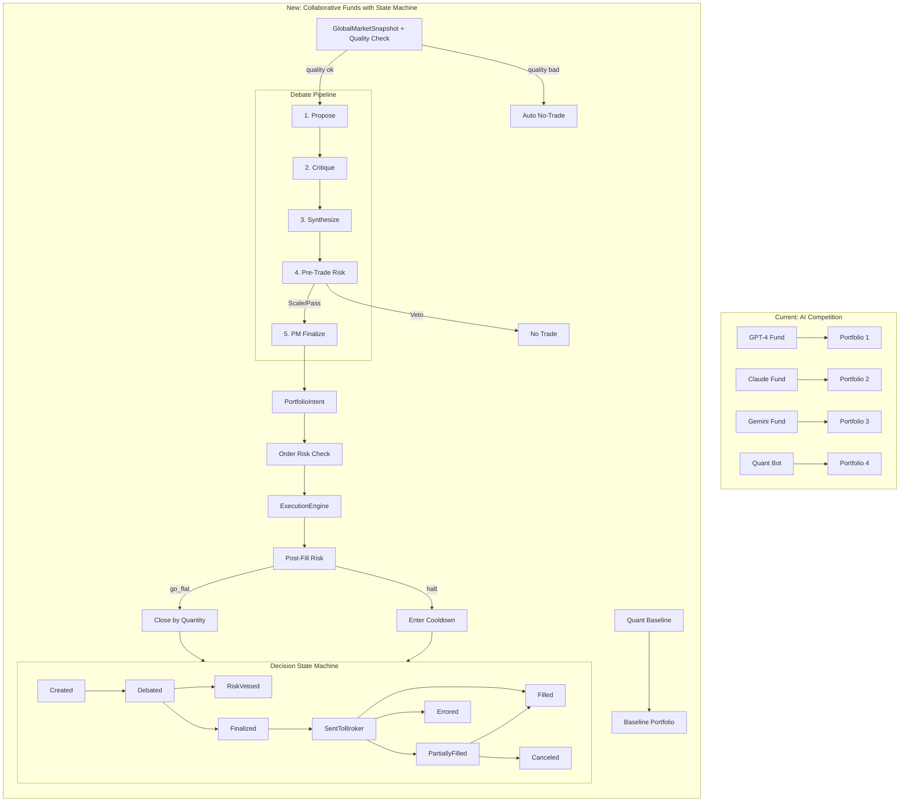

# Collaborative Thesis-Driven Funds Refactor

## V1 Scope (Frozen)

**What we ARE building:**

- Clean, reproducible decision pipeline with full audit trail
- Idempotent execution with state machine
- Multi-stage risk checking with explicit violations
- Trade-level outcome storage for later analysis
- Fund-specific PM finalizers

**What we are NOT building in v1:**

- No smart order routing (market orders only)
- No complex slippage models (fixed bps assumption)
- No cross-fund netting or position sharing
- No ML training loop for participant weights
- No dynamic model selection based on performance
- No real-time streaming (batch decisions only)

---

## Architecture Shift



## Fund Definitions

- **Trend + Macro**: Regime detection with trend following (1-20 days, liquid ETFs/futures)
- **Mean Reversion**: Exploit overreactions (intraday to 3 days, liquid equities)
- **Event-Driven**: Earnings plays (-3 to +5 days, options-liquid names)
- **Quality L/S**: Fundamentals (weeks to months, large caps) - **can be long-short**

---

## Core Components

### 0. Centralized Constants ([python/core/config/constants.py](python/core/config/constants.py))

**Environment-aware via env vars. No module-level singleton that can't be overridden.**

```python
"""
Centralized constants for the trading system.
All tolerances and thresholds live here.
Override via environment variables for testing.
"""
import os
from dataclasses import dataclass

def _env_float(key: str, default: float) -> float:
    return float(os.environ.get(key, default))

def _env_int(key: str, default: int) -> int:
    return int(os.environ.get(key, default))

@dataclass(frozen=True)
class SnapshotConstants:
    """GlobalMarketSnapshot quality thresholds"""
    MIN_COVERAGE_RATIO: float = _env_float("SNAPSHOT_MIN_COVERAGE", 0.8)
    MAX_STALENESS_SECONDS: int = _env_int("SNAPSHOT_MAX_STALE_SEC", 3600)

@dataclass(frozen=True)
class ExecutionConstants:
    """Execution engine tolerances"""
    MIN_WEIGHT_DELTA: float = _env_float("EXEC_MIN_WEIGHT_DELTA", 0.001)
    GROSS_EXPOSURE_TOLERANCE: float = _env_float("EXEC_GROSS_TOLERANCE", 0.01)

@dataclass(frozen=True)
class RiskConstants:
    """Risk check tolerances"""
    ORDER_SIZE_TOLERANCE: float = _env_float("RISK_ORDER_TOLERANCE", 0.05)

@dataclass(frozen=True)
class UniverseConstants:
    """Universe resolver thresholds"""
    DEFAULT_MIN_SYMBOLS: int = _env_int("UNIVERSE_MIN_SYMBOLS", 5)

@dataclass(frozen=True)
class Constants:
    """Master constants container - constructed once at import"""
    snapshot: SnapshotConstants = SnapshotConstants()
    execution: ExecutionConstants = ExecutionConstants()
    risk: RiskConstants = RiskConstants()
    universe: UniverseConstants = UniverseConstants()

# Single instance, but values read from env at import time
# For tests: set env vars BEFORE importing, or mock this module
CONSTANTS = Constants()
```

### 1. GlobalMarketSnapshot ([python/core/data/snapshot.py](python/core/data/snapshot.py))

**Added `has_required_data()` for checking actual data availability per symbol.**

```python
from core.config.constants import CONSTANTS

@dataclass
class DataQuality:
    """Snapshot quality flags - auto no-trade if below threshold"""
    coverage_ratio: float
    staleness_seconds: Dict[str, int]
    missing_fields: Dict[str, List[str]]
    warnings: List[str]
    
    def is_tradeable(self) -> bool:
        return self.coverage_ratio >= CONSTANTS.snapshot.MIN_COVERAGE_RATIO
    
    def to_summary(self) -> Dict:
        return {
            "coverage_ratio": self.coverage_ratio,
            "max_staleness": max(self.staleness_seconds.values(), default=0),
            "warnings": self.warnings[:5],
        }

@dataclass
class GlobalMarketSnapshot:
    """Immutable, fund-agnostic data contract."""
    snapshot_id: str
    asof_timestamp: datetime
    
    prices: Dict[str, float]
    returns: Dict[str, Dict[str, float]]
    volatility: Dict[str, Dict[str, float]]
    correlations: Dict[str, Dict[str, float]]
    
    upcoming_earnings: List[EarningsEvent]
    recent_macro_releases: List[MacroRelease]
    news_summaries: List[NewsSummary]
    
    quality: DataQuality
    coverage_symbols: List[str]
    data_sources: List[str]
    
    def has_required_data(self, symbol: str, require_vol: bool = True) -> bool:
        """
        Check if symbol has actual data, not just listed in coverage.
        Use this for filtering, not coverage_symbols.
        """
        if symbol not in self.prices:
            return False
        if symbol not in self.returns:
            return False
        if require_vol and symbol not in self.volatility:
            return False
        return True
    
    def available_features(self) -> Set[str]:
        features = set()
        if self.prices:
            features.add("prices")
        for period in ["1d", "5d", "1m", "3m"]:
            if any(period in r for r in self.returns.values()):
                features.add(f"returns.{period}")
        for period in ["5d", "21d", "63d"]:
            if any(period in v for v in self.volatility.values()):
                features.add(f"volatility.{period}")
        if self.correlations:
            features.add("correlations")
        if self.upcoming_earnings:
            features.add("upcoming_earnings")
        if self.recent_macro_releases:
            features.add("recent_macro_releases")
        if self.news_summaries:
            features.add("news_summaries")
        return features
    
    def validate_or_reject(self) -> Tuple[bool, Optional[str]]:
        if not self.quality.is_tradeable():
            return False, f"Coverage {self.quality.coverage_ratio:.0%} below threshold"
        max_stale = max(self.quality.staleness_seconds.values(), default=0)
        if max_stale > CONSTANTS.snapshot.MAX_STALENESS_SECONDS:
            return False, f"Data stale by {max_stale}s"
        return True, None

SNAPSHOT_INSTRUCTION = """
You may ONLY reference data from the provided GlobalMarketSnapshot.
Do NOT assume or hallucinate any market facts, news, or events
not explicitly included in the snapshot.
Your features_used field MUST be a subset of snapshot.available_features().
Use consistent feature paths: returns.1d, volatility.21d, etc.
"""
```

### 2. Universe Resolver ([python/core/funds/universe.py](python/core/funds/universe.py))

**Filter by actual data availability (snapshot.has_required_data), not just coverage_symbols.**

```python
@dataclass
class UniverseResult:
    success: bool
    symbols: List[str]
    coverage_ratio: float
    missing_symbols: List[str]
    notes: List[str]
    universe_hash: str
    error: Optional[str] = None
    
    def to_summary(self) -> Dict:
        return {
            "coverage_ratio": self.coverage_ratio,
            "missing_symbols_count": len(self.missing_symbols),
            "notes": self.notes[:3],
            "universe_hash": self.universe_hash,
        }

class UniverseResolver:
    """Resolves universe specs against a global snapshot"""
    
    def resolve(
        self, 
        spec: UniverseSpec, 
        snapshot: GlobalMarketSnapshot,
        require_vol: bool = True  # strategy-dependent
    ) -> UniverseResult:
        if spec.type == "etf_set":
            candidates = self._get_etf_set(spec.params["name"])
        elif spec.type == "screen":
            candidates = self._apply_screen(spec.params)
        elif spec.type == "explicit":
            candidates = spec.params["symbols"]
        else:
            raise ValueError(f"Unknown universe type: {spec.type}")
        
        # FIXED: Filter by actual data availability, not just coverage_symbols
        covered = [
            s for s in candidates 
            if snapshot.has_required_data(s, require_vol=require_vol)
        ]
        missing = [
            s for s in candidates 
            if not snapshot.has_required_data(s, require_vol=require_vol)
        ]
        coverage_ratio = len(covered) / len(candidates) if candidates else 0
        
        notes = []
        if missing:
            notes.append(f"{len(missing)} symbols missing required data")
        
        if len(covered) < spec.min_symbols:
            return UniverseResult(
                success=False,
                symbols=[],
                coverage_ratio=coverage_ratio,
                missing_symbols=missing,
                notes=notes,
                universe_hash="",
                error=f"Only {len(covered)} symbols have data, need {spec.min_symbols}"
            )
        
        return UniverseResult(
            success=True,
            symbols=covered,
            coverage_ratio=coverage_ratio,
            missing_symbols=missing,
            notes=notes,
            universe_hash=compute_universe_hash(covered)
        )
```

### 3. Fund Model ([python/core/funds/fund.py](python/core/funds/fund.py))

```python
@dataclass
class FundThesis:
    name: str
    strategy: str
    description: str
    horizon_days: Tuple[int, int]
    universe_spec: UniverseSpec
    edge: str
    version: str = "1.0"

@dataclass
class FundPolicy:
    sizing_method: str
    vol_target: Optional[float]
    max_position_pct: float
    max_turnover_daily: float
    rebalance_cadence: str
    max_positions: int = 20
    
    default_stop_loss_pct: float
    default_take_profit_pct: float
    trailing_stop: bool
    
    # Exposure limits (works for long-short)
    max_gross_exposure: float  # e.g., 1.5 for 150% gross
    min_cash_buffer: float  # e.g., 0.05 for 5% minimum cash
    
    go_flat_on_circuit_breaker: bool
    version: str = "1.0"

@dataclass
class PMConfig:
    model_provider: str
    model_name: str
    prompt_template: str
    prompt_hash: str  # INCLUDED in inputs_hash now
    temperature: float = 0.3

@dataclass  
class Fund:
    fund_id: str
    thesis: FundThesis
    policy: FundPolicy
    pm_config: PMConfig
    risk_limits: RiskLimits
    portfolio: FundPortfolio
    is_active: bool
```

### 4. Decision State Machine ([python/core/execution/state_machine.py](python/core/execution/state_machine.py))

**inputs_hash now includes PM prompt hash.**

```python
def compute_inputs_hash(
    snapshot_id: str,
    universe_hash: str,
    fund_policy_version: str,
    fund_thesis_version: str,
    pm_prompt_hash: str  # ADDED: PM instructions are an input
) -> str:
    """
    Hash of all decision inputs.
    If two decisions have same inputs_hash but different outputs,
    you know the non-determinism came from the model.
    """
    import hashlib
    payload = ":".join([
        snapshot_id,
        universe_hash,
        fund_policy_version,
        fund_thesis_version,
        pm_prompt_hash  # PM prompt changes affect output
    ])
    return hashlib.sha256(payload.encode()).hexdigest()[:16]

@dataclass
class DecisionRecord:
    """Structured decision with lifecycle tracking"""
    decision_id: str
    fund_id: str
    snapshot_id: str
    asof_timestamp: datetime
    
    idempotency_key: str
    run_context: RunContext
    decision_window_start: datetime
    
    decision_type: DecisionType
    no_trade_reason: Optional[NoTradeReason]
    
    status: DecisionStatus
    status_history: List[StatusTransition]
    
    intent: Optional[PortfolioIntent]
    risk_result: Optional[RiskCheckResult]
    
    snapshot_quality_json: Dict
    universe_result_json: Dict
    
    universe_hash: Optional[str]
    inputs_hash: Optional[str]  # now includes pm_prompt_hash
    
    model_versions: Dict[str, str]
    prompt_hashes: Dict[str, str]
    
    predicted_directions: Dict[str, str]
    expected_holding_days: Optional[int]
    expected_return: Optional[float]
```

### 5. PortfolioIntent ([python/core/execution/intent.py](python/core/execution/intent.py))

**FIXED: Validate gross exposure and cash buffer, not abs-sum = 1. Works for long-short.**

```python
from core.config.constants import CONSTANTS

class WeightBasis(Enum):
    NAV = "nav"  # % of total portfolio value

@dataclass
class PortfolioIntent:
    """Target portfolio state - broker agnostic"""
    intent_id: str
    fund_id: str
    asof_timestamp: datetime
    
    portfolio_value: float
    asof_prices: Dict[str, float]
    valuation_timestamp: datetime
    
    weight_basis: WeightBasis = WeightBasis.NAV
    
    positions: List[PositionIntent]
    target_cash_pct: float
    
    max_turnover: float
    execution_window_minutes: int
    
    sizing_method_used: str
    policy_version: str
    
    exit_rules: List[ExitRule]
    
    def validate_exposures(self, policy: FundPolicy) -> Tuple[bool, Optional[str]]:
        """
        FIXED: Validate gross exposure and cash, not abs-sum = 1.
        This correctly supports long-short funds.
        
        For a long-short fund:
        - gross = sum(abs(w)) can be 1.5, 2.0, etc.
        - net = sum(w) can be anything
        - We just enforce gross <= max_gross_exposure and cash >= min_cash_buffer
        """
        # Compute gross exposure
        gross_exposure = sum(abs(p.target_weight) for p in self.positions)
        
        # Compute net exposure (signed sum)
        net_exposure = sum(p.target_weight for p in self.positions)
        
        tolerance = CONSTANTS.execution.GROSS_EXPOSURE_TOLERANCE
        
        # Check gross exposure limit
        if gross_exposure > policy.max_gross_exposure + tolerance:
            return False, (
                f"Gross exposure {gross_exposure:.2f} exceeds limit "
                f"{policy.max_gross_exposure:.2f}"
            )
        
        # Check cash buffer
        if self.target_cash_pct < policy.min_cash_buffer - tolerance:
            return False, (
                f"Cash {self.target_cash_pct:.2%} below minimum "
                f"{policy.min_cash_buffer:.2%}"
            )
        
        # Optional: log net exposure for monitoring (not enforced in v1)
        # print(f"Net exposure: {net_exposure:.2f}")
        
        return True, None

class ExecutionEngine:
    """Converts PortfolioIntent to broker orders"""
    
    def execute(
        self, 
        intent: PortfolioIntent,
        current_portfolio: PortfolioState,
        policy: FundPolicy
    ) -> Tuple[List[Order], Optional[str]]:
        """Returns (orders, error)"""
        
        # Validate exposures (not abs-sum)
        valid, error = intent.validate_exposures(policy)
        if not valid:
            return [], error
        
        orders = []
        for pos_intent in intent.positions:
            current_weight = current_portfolio.get_weight(
                pos_intent.symbol, 
                basis=intent.weight_basis
            )
            delta_weight = pos_intent.target_weight - current_weight
            
            if abs(delta_weight) < CONSTANTS.execution.MIN_WEIGHT_DELTA:
                continue
            
            price = intent.asof_prices[pos_intent.symbol]
            
            order = self._create_order(
                symbol=pos_intent.symbol,
                delta_weight=delta_weight,
                portfolio_value=intent.portfolio_value,
                price=price,
                urgency=pos_intent.urgency
            )
            orders.append(order)
        
        return orders, None
```

### 6. Risk Manager ([python/core/execution/risk_manager.py](python/core/execution/risk_manager.py))

**FIXED: go_flat creates quantity-based close orders, no stale prices.**

```python
@dataclass
class CloseOrder:
    """
    Quantity-based close order - no price needed.
    Matches v1 scope: market orders only.
    """
    symbol: str
    quantity: float  # positive = close long, negative = close short
    side: str  # "sell" for longs, "buy" for shorts (to close)
    order_type: str = "market"
    urgency: str = "immediate"
    max_slippage_bps: int = 50  # accept more slippage for emergency

@dataclass
class PostFillAction:
    """Result of post-fill risk check"""
    action: str  # "none", "halt", "go_flat"
    reason: Optional[str]
    close_orders: List[CloseOrder]  # CHANGED: quantity-based, not intent

class RiskManager:
    """Multi-stage risk checking with repository pattern"""
    
    def __init__(self, risk_state_repo: FundRiskStateRepo):
        self.risk_state_repo = risk_state_repo
    
    def check_intent(
        self, 
        intent: PortfolioIntent,
        fund: Fund,
        current_state: PortfolioState
    ) -> RiskCheckResult:
        risk_state = self.risk_state_repo.get(fund.fund_id)
        
        if risk_state and risk_state.is_in_cooldown():
            return RiskCheckResult(
                status="vetoed",
                scale_factor=0.0,
                per_symbol_scales={},
                violations=[RiskViolation(
                    rule_name="cooldown",
                    symbol=None,
                    limit=0,
                    actual=0,
                    severity="veto"
                )],
                applied_rules=["cooldown"],
                reason=f"In cooldown until {risk_state.risk_off_until}"
            )
        
        return self._check_position_limits(intent, fund)
    
    def check_orders(
        self,
        orders: List[Order],
        fund: Fund,
        current_state: PortfolioState
    ) -> RiskCheckResult:
        violations = []
        
        for order in orders:
            projected_value = order.quantity * order.expected_price
            projected_weight = projected_value / current_state.total_value
            
            tolerance = 1.0 + CONSTANTS.risk.ORDER_SIZE_TOLERANCE
            if projected_weight > fund.risk_limits.max_position_pct * tolerance:
                violations.append(RiskViolation(
                    rule_name="order_size_exceeds_limit",
                    symbol=order.symbol,
                    limit=fund.risk_limits.max_position_pct,
                    actual=projected_weight,
                    severity="veto"
                ))
        
        if violations:
            return RiskCheckResult(
                status="vetoed",
                scale_factor=0.0,
                per_symbol_scales={},
                violations=violations,
                applied_rules=["order_size_check"],
                reason="Order validation failed"
            )
        
        return RiskCheckResult(
            status="approved",
            scale_factor=1.0,
            per_symbol_scales={},
            violations=[],
            applied_rules=["order_size_check"],
            reason=None
        )
    
    def check_post_fill(
        self,
        fills: List[Fill],
        fund: Fund,
        new_state: PortfolioState
    ) -> PostFillAction:
        """
        FIXED: go_flat returns quantity-based close orders, not a new intent.
        No stale prices - just close current quantities at market.
        """
        self._update_pnl_tracking(fund, new_state)
        
        risk_state = self.risk_state_repo.get(fund.fund_id)
        if risk_state and self._circuit_breaker_tripped(fund, risk_state):
            self._enter_cooldown(fund, "circuit_breaker")
            
            if fund.policy.go_flat_on_circuit_breaker:
                # Generate quantity-based close orders (no prices needed)
                close_orders = self._generate_close_orders(new_state)
                return PostFillAction(
                    action="go_flat",
                    reason="Circuit breaker tripped - closing all positions",
                    close_orders=close_orders
                )
            else:
                return PostFillAction(
                    action="halt",
                    reason="Circuit breaker tripped - halting trading",
                    close_orders=[]
                )
        
        return PostFillAction(action="none", reason=None, close_orders=[])
    
    def _generate_close_orders(
        self,
        current_state: PortfolioState
    ) -> List[CloseOrder]:
        """
        FIXED: Generate close orders by current quantity.
        No price calculation needed - market orders at current quantity.
        """
        close_orders = []
        
        for symbol, position in current_state.positions.items():
            if position.quantity == 0:
                continue
            
            # Close longs by selling, close shorts by buying
            if position.quantity > 0:
                close_orders.append(CloseOrder(
                    symbol=symbol,
                    quantity=position.quantity,
                    side="sell",
                    order_type="market",
                    urgency="immediate",
                    max_slippage_bps=50
                ))
            else:
                close_orders.append(CloseOrder(
                    symbol=symbol,
                    quantity=abs(position.quantity),
                    side="buy",
                    order_type="market",
                    urgency="immediate",
                    max_slippage_bps=50
                ))
        
        return close_orders
    
    def _enter_cooldown(self, fund: Fund, reason: str):
        cooldown_until = datetime.utcnow() + timedelta(
            days=fund.risk_limits.breach_cooldown_days
        )
        state = FundRiskState(
            fund_id=fund.fund_id,
            risk_off_until=cooldown_until,
            last_breach_reason=reason,
            last_breach_time=datetime.utcnow(),
            current_daily_pnl_pct=0,
            current_weekly_drawdown_pct=0
        )
        self.risk_state_repo.upsert(state)
```

### 7. Baseline Fallback ([python/core/funds/baseline.py](python/core/funds/baseline.py))

```python
@dataclass
class BaselineFallbackPolicy:
    enabled: bool = True
    max_consensus_to_trigger: float = 0.3
    require_risk_approval: bool = True
    min_baseline_confidence: float = 0.6
    fund_must_not_be_in_cooldown: bool = True
    scale_down_factor: float = 0.5
    max_position_from_baseline: float = 0.10
```

### 8. AI Participant ([python/core/collaboration/participant.py](python/core/collaboration/participant.py))

```python
class AIParticipant:
    def validate_features_used(
        self, 
        features: List[str], 
        snapshot: GlobalMarketSnapshot
    ) -> None:
        available = snapshot.available_features()
        for f in features:
            if f not in available:
                raise InvalidFeatureError(
                    f"Feature '{f}' not available in snapshot. "
                    f"Available: {sorted(available)}"
                )
```

### 9. Database Schema ([python/db/models.py](python/db/models.py))

```python
class DecisionRecord(Base):
    __tablename__ = "decision_records"
    
    id = Column(String(50), primary_key=True)
    fund_id = Column(String(50), ForeignKey("funds.id"))
    snapshot_id = Column(String(50), nullable=False)
    asof_timestamp = Column(DateTime, nullable=False)
    
    idempotency_key = Column(String(32), unique=True, nullable=False)
    run_context = Column(String(20), nullable=False)
    decision_window_start = Column(DateTime, nullable=False)
    
    decision_type = Column(String(20), nullable=False)
    no_trade_reason = Column(String(30), nullable=True)
    
    status = Column(String(30), nullable=False)
    status_history_json = Column(JSON)
    
    intent_json = Column(JSON)
    risk_result_json = Column(JSON)
    
    snapshot_quality_json = Column(JSON)
    universe_result_json = Column(JSON)
    
    universe_hash = Column(String(20), nullable=True)
    inputs_hash = Column(String(20), nullable=True)  # includes pm_prompt_hash now
    
    model_versions_json = Column(JSON)
    prompt_hashes_json = Column(JSON)
    
    predicted_directions_json = Column(JSON)
    expected_return = Column(Float)
    expected_holding_days = Column(Integer)
    
    created_at = Column(DateTime, default=datetime.utcnow)
```

### 10. Minimal Evals (v1) ([python/core/evals/metrics.py](python/core/evals/metrics.py))

```python
@dataclass
class FundMetrics:
    fund_id: str
    period_start: date
    period_end: date
    
    n_trades: int
    avg_return: float
    median_return: float
    hit_rate: float
    max_drawdown: float
    brier_score: float
    turnover: float
    avg_holding_days: float
    avg_slippage_bps: float
```

---

## File Changes Summary

**New files:**

- `python/core/config/__init__.py`
- `python/core/config/constants.py` - Env-var overridable tolerances
- `python/core/data/__init__.py`
- `python/core/data/snapshot.py` - GlobalMarketSnapshot with has_required_data()
- `python/core/funds/__init__.py`
- `python/core/funds/fund.py` - Fund, FundThesis, FundPolicy
- `python/core/funds/universe.py` - UniverseResolver filtering by actual data
- `python/core/funds/baseline.py` - BaselineFallbackPolicy
- `python/core/execution/state_machine.py` - DecisionStateMachine, inputs_hash with PM prompt
- `python/core/execution/intent.py` - PortfolioIntent with exposure validation
- `python/core/execution/risk_repo.py` - FundRiskStateRepo interface
- `python/core/collaboration/__init__.py`
- `python/core/collaboration/debate.py` - DebateEngine pipeline
- `python/core/collaboration/participant.py` - AIParticipant
- `python/core/collaboration/schemas.py` - JSON output schemas
- `python/core/evals/__init__.py`
- `python/core/evals/metrics.py` - FundMetrics, Brier score
- `frontend/src/components/FundCard.tsx`
- `frontend/src/components/DebateViewer.tsx`

**Modified files:**

- `python/db/models.py` - Fund, DecisionRecord (with inputs_hash), TradeOutcome, FundRiskState
- `python/core/execution/risk_manager.py` - 3-stage risk with quantity-based go_flat
- `python/core/execution/trading_engine.py` - snapshot quality + idempotency
- `python/core/managers/llm_manager.py` - refactor to AIParticipant
- `python/app/main.py` - fund + decision endpoints
- `python/app/schemas.py` - fund schemas
- `frontend/src/types/index.ts` - fund types
- `frontend/src/components/Leaderboard.tsx` - show funds

---

## Key Design Decisions

1. **Constants via env vars**: Set at import time, testable without module mocking
2. **Consistent naming**: "GlobalMarketSnapshot" everywhere
3. **Exposure validation (not abs-sum)**: `gross <= max_gross_exposure` and `cash >= min_cash_buffer` - works for long-short
4. **Universe filtering by actual data**: `snapshot.has_required_data(symbol)` not just `coverage_symbols`
5. **Quantity-based go_flat**: `CloseOrder` with current quantity, no stale prices
6. **inputs_hash includes PM prompt**: `hash(snapshot, universe, policy, thesis, pm_prompt)`
7. **FundRiskStateRepo interface**: In-memory for backtest, DB for live
8. **max_positions in FundPolicy**: Prevents models from outputting 37 tiny positions
9. **Context summaries in DecisionRecord**: `snapshot_quality_json`, `universe_result_json`
10. **Terminal states**: FILLED, CANCELED, ERRORED, RISK_VETOED cannot transition out
11. **Dynamic feature validation**: `snapshot.available_features()` not hardcoded list
12. **Decision always has type**: `decision_type` + `no_trade_reason` for debugging
13. **Model versioning**: Every decision stores `model_name`, `model_version`, `prompt_hash`