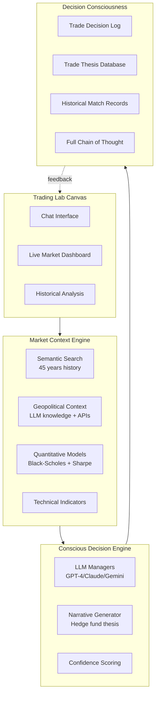

# Conscious AI Hedge Fund - Deep Trading Intelligence

## Current Status: READY TO BUILD

**Data Foundation Complete:**

- ✅ 501/503 S&P 500 stocks with embeddings
- ✅ ~2.5+ million historical market states indexed
- ✅ 45+ years of data for mature stocks
- Semantic search infrastructure  not ready yet . needs work. 
- ✅ Frontend + Backend running

**Next Phase:** Build the conscious decision-making layer on top of this foundation.

## Architecture Overview



## Phase 1: Enhanced Context Engine

### 1.1 Deep Semantic Context Provider

**New file:** [`python/core/context/market_context.py`](python/core/context/market_context.py)

```python
class MarketContextProvider:
    """
    Provides deep historical context for trading decisions.
    Goes beyond simple pattern matching to provide narrative.
    """
    
    def get_deep_context(self, symbol: str, current_date: str) -> DeepContext:
        """
        Returns:
        - Top 20 similar periods with full narratives
        - What happened before/during/after each period
        - Geopolitical context (e.g., "Fed rate hike cycle")
        - Market regime classification
        - Forward outcome distributions
        """
    
    def analyze_similar_period(self, date: str) -> PeriodAnalysis:
        """
        Deep dive into a single historical period:
        - What was happening globally (recession, war, policy)
        - How did institutions respond
        - What worked, what failed
        - Sector rotation patterns
        """
```

**Extends:** [`python/core/semantic/search.py`](python/core/semantic/search.py)

- Add geopolitical context extraction
- LLM calls to interpret historical periods
- Link similar periods to known market events

### 1.2 Quantitative Model Integration

**New file:** [`python/core/quant/models.py`](python/core/quant/models.py)

```python
class QuantitativeModels:
    """Hybrid quantitative + ML models"""
    
    def black_scholes_greeks(self, symbol: str) -> Greeks:
        """Options pricing and risk metrics"""
    
    def portfolio_optimization(
        self, 
        signals: Dict,
        optimize_for: str = "sharpe"  # or "black_scholes", "sortino"
    ) -> OptimalWeights:
        """
        Modern portfolio theory optimization
        - Sharpe ratio maximization
        - Risk-adjusted returns
        - Correlation analysis
        - Drawdown constraints
        """
    
    def market_outperformance_score(self, strategy: str) -> float:
        """
        Score potential vs benchmark (SPY)
        - Risk-adjusted alpha
        - Information ratio
        - Calmar ratio
        """
```

**Technology:**

- `scipy.optimize` for portfolio optimization
- `py_vollib` for Black-Scholes
- Custom ML models for return prediction

### 1.3 Hybrid External Data Integration

**New file:** [`python/core/context/external_data.py`](python/core/context/external_data.py)

```python
class ExternalDataProvider:
    """
    Hybrid approach: Facts from APIs, interpretation from LLMs
    """
    
    def get_economic_calendar(self) -> List[Event]:
        """Upcoming Fed meetings, earnings, GDP releases"""
    
    def get_market_sentiment(self) -> Sentiment:
        """Fear/Greed index, VIX, put/call ratios"""
    
    def llm_interpret_context(self, raw_data: Dict) -> str:
        """
        LLM interprets:
        - Is this rate hike hawkish or dovish given context?
        - How does this compare to 2008? 2018?
        - What are institutions likely doing?
        """
```

**APIs to integrate:**

- Federal Reserve Economic Data (FRED) - free
- Market sentiment indicators (free via yfinance)
- LLM built-in knowledge for interpretation

## Phase 2: Conscious Decision Engine

### 2.1 Enhanced LLM Manager with Depth

**Update:** [`python/core/managers/llm_manager.py`](python/core/managers/llm_manager.py)

Current prompt is shallow. New version:

```python
def _build_deep_prompt(self, context: ManagerContext) -> str:
    """
    Build narrative-style prompt with full context
    """
    
    semantic_context = self.context_provider.get_deep_context(
        symbol, current_date
    )
    
    prompt = f"""
    You are {self.name}, managing ${portfolio_value:,.0f}.
    
    ## Market Understanding
    
    Today feels like: {semantic_context.similar_periods[0].narrative}
    
    Historical precedents (top 5 most similar):
    1. {date1} - {narrative1}
       → Outcome: {outcome1}
       → Geopolitical: {geo1}
       
    2. {date2} - {narrative2}
       → Outcome: {outcome2}
       → Geopolitical: {geo2}
    
    [... 3 more ...]
    
    ## Quantitative Edge
    
    Portfolio optimization suggests:
    - Sharpe-optimal allocation: {optimal_weights}
    - Expected excess return vs SPY: {alpha:+.2%}
    - Risk-adjusted opportunity: {risk_score}/10
    
    Black-Scholes analysis:
    - Implied volatility: {iv:.1%} (vs realized {rv:.1%})
    - Options market suggests: {options_signal}
    
    ## Your Task
    
    Write a trading thesis like a hedge fund manager. Include:
    
    1. Market Regime Analysis
       - What phase are we in? (expansion, contraction, crisis, recovery)
       - How certain are you based on historical matches?
    
    2. Trade Rationale
       - Why this trade, why now?
       - Which historical period is most relevant?
       - What's different this time?
    
    3. Risk Assessment
       - What could go wrong?
       - Historical max drawdown in similar periods?
       - Position sizing based on conviction
    
    4. Exit Strategy
       - What conditions would make you exit?
       - Time horizon based on historical patterns
    
    Format as narrative JSON:
    {{
      "thesis": "Your complete investment thesis...",
      "conviction": 0.85,
      "trades": [
        {{
          "action": "buy",
          "symbol": "AAPL",
          "size": 0.15,
          "reasoning": "Detailed reasoning...",
          "historical_precedent": "2020-03-23",
          "expected_holding_period": "3-6 months",
          "stop_loss": -0.08,
          "target_return": 0.25
        }}
      ],
      "risks": ["List of key risks..."],
      "market_regime": "early_recovery",
      "geopolitical_factors": ["Factor 1", "Factor 2"]
    }}
    """
```

### 2.2 Decision Consciousness Logging

**New file:** [`python/core/logging/decision_logger.py`](python/core/logging/decision_logger.py)

```python
class DecisionLogger:
    """
    Logs every aspect of trading decisions for analysis
    """
    
    def log_decision(
        self,
        manager_id: str,
        decision: TradingDecision,
        context: DeepContext,
        thesis: str,
        historical_matches: List[HistoricalMatch]
    ) -> str:
        """
        Stores:
        - Full LLM response (thesis)
        - All historical precedents considered
        - Quantitative scores (Sharpe, Black-Scholes)
        - Market conditions at decision time
        - Geopolitical context
        - Confidence score
        
        Returns: decision_id for tracking
        """
    
    def generate_performance_narrative(
        self,
        decision_id: str,
        actual_outcome: float
    ) -> str:
        """
        Post-trade analysis:
        "You thought this was like 2020-03-23 (COVID recovery).
        You were right about direction but wrong about magnitude.
        Actual outcome: +12% vs expected +25%.
        Key difference: Fed policy was more hawkish than 2020."
        """
```

**Database schema:**

```sql
-- New table: decision_logs
CREATE TABLE decision_logs (
    id SERIAL PRIMARY KEY,
    manager_id VARCHAR(50),
    timestamp TIMESTAMP,
    symbol VARCHAR(10),
    action VARCHAR(10),
    size DECIMAL,
    
    -- The thesis (narrative)
    thesis TEXT,
    conviction DECIMAL,
    
    -- Historical context
    top_historical_match VARCHAR(20),  -- Date
    historical_match_similarity DECIMAL,
    historical_narrative TEXT,
    
    -- Quantitative
    sharpe_ratio_expected DECIMAL,
    black_scholes_iv DECIMAL,
    portfolio_weight_optimal DECIMAL,
    
    -- Geopolitical
    geopolitical_factors JSON,
    market_regime VARCHAR(50),
    
    -- Outcome tracking
    expected_return DECIMAL,
    actual_return DECIMAL,
    holding_period_days INT,
    exit_reason TEXT
);
```

## Phase 3: Trading Lab Canvas

### 3.1 Chat Interface Backend

**New file:** [`python/app/chat.py`](python/app/chat.py)

```python
class TradingLabChat:
    """
    Conversational interface for market research
    """
    
    async def handle_query(self, user_query: str) -> ChatResponse:
        """
        Examples:
        - "What happened after every Fed rate hike in the last 20 years?"
        - "Show me all market bottoms and what preceded them"
        - "Compare 2008 financial crisis to 2020 COVID crash"
        - "Is AAPL overvalued based on historical multiples?"
        
        Returns rich responses with:
        - Text analysis
        - Charts/visualizations
        - Historical data points
        - Actionable insights
        """
    
    def semantic_query(self, natural_language: str) -> SearchResults:
        """Convert questions to semantic searches"""
    
    def generate_research_report(
        self,
        topic: str,
        stocks: List[str]
    ) -> ResearchReport:
        """AI-generated research report on any topic"""
```

### 3.2 Frontend: Chat + Dashboard Split Screen

**New file:** [`frontend/src/app/lab/page.tsx`](frontend/src/app/lab/page.tsx)

```tsx
export default function TradingLab() {
  return (
    <div className="grid grid-cols-2 h-screen">
      {/* Left: Chat interface */}
      <ChatPanel 
        onQuery={handleQuery}
        history={chatHistory}
      />
      
      {/* Right: Live dashboard */}
      <DashboardPanel
        selectedStock={selectedStock}
        historicalContext={context}
        liveDecisions={decisions}
      />
    </div>
  );
}
```

**Components:**

- `ChatPanel` - Message history, input, example queries
- `DashboardPanel` - Live positions, recent decisions, market state
- `HistoricalMatchCard` - Shows similar period with narrative
- `ThesisViewer` - Displays LLM thesis with expandable reasoning

### 3.3 Research Query Engine

**New endpoints in** [`python/app/main.py`](python/app/main.py):

```python
@app.post("/api/lab/chat")
async def lab_chat(query: ChatQuery):
    """
    Handle conversational queries about markets
    """
    
@app.get("/api/lab/research/{topic}")
async def research_topic(topic: str, symbols: List[str]):
    """
    Generate research report on a topic
    Example: /api/lab/research/fed_policy?symbols=SPY,TLT
    """

@app.get("/api/lab/decisions/narrative/{decision_id}")
async def get_decision_narrative(decision_id: str):
    """
    Get full narrative for a past decision including:
    - Original thesis
    - Historical matches
    - Actual outcome
    - Lessons learned
    """
```

## Phase 4: Advanced Features

### 4.1 Multi-Timeframe Analysis

```python
class MultiTimeframeAnalyzer:
    """
    Analyze across different timeframes simultaneously
    """
    
    def analyze(self, symbol: str) -> MultiTimeframeView:
        """
        Returns:
        - Intraday: Current momentum, volume
        - Daily: Technical patterns, support/resistance
        - Weekly: Trend direction, momentum
        - Monthly: Macro regime, sector rotation
        - Yearly: Long-term positioning
        
        Plus historical matches for each timeframe
        """
```

### 4.2 Sector Rotation Intelligence

```python
class SectorRotationEngine:
    """
    Understand sector dynamics and rotation patterns
    """
    
    def detect_rotation(self) -> RotationSignal:
        """
        Identify:
        - Which sectors are leading/lagging
        - Historical rotation patterns
        - Early vs late cycle positioning
        - Risk-on vs risk-off signals
        """
```

### 4.3 Performance Attribution

```python
class PerformanceAttributor:
    """
    Break down returns by decision factors
    """
    
    def attribute_returns(self, period: str) -> Attribution:
        """
        Answer:
        - How much alpha came from semantic search insights?
        - How much from quantitative models?
        - Which historical precedents were most valuable?
        - What mistakes did the LLM make?
        """
```

## Implementation Order

### Week 1: Foundation

1. Build `MarketContextProvider` with deep historical narratives
2. Integrate quantitative models (Black-Scholes, Sharpe)
3. Update database schema for decision logging

### Week 2: Enhanced LLM System

1. Rewrite LLM prompts for narrative depth
2. Implement `DecisionLogger` with full consciousness
3. Add external data provider (hybrid approach)

### Week 3: Trading Lab Interface

1. Build chat backend with semantic query parsing
2. Create frontend split-screen layout
3. Implement research query engine

3. Create example research reports
4. Backtest against SPY benchmark

## Key Technical Decisions

**LLM Strategy:** Use GPT-4/Claude for deep reasoning, not just classification

- Temperature 0.3-0.5 for consistency
- Long context windows (32k+) for full historical narrative
- Structured JSON output with narrative fields

**Quantitative Models:**

- Scipy for optimization
- Custom Sharpe/Sortino calculators
- Black-Scholes via py_vollib
- ML models as additional signal (not replacement)

**Data Storage:**

- PostgreSQL for structured logs (decisions, outcomes)
- ChromaDB for semantic embeddings (existing)
- JSON fields for flexible narrative storage

**Performance Target:**

- Beat SPY by 5%+ annually (risk-adjusted)
- Sharpe ratio > 1.5
- Max drawdown < 20%
- Win rate > 55%

## Success Metrics

**Depth of Understanding:**

- Every trade has 500+ word thesis
- Historical precedents cited for 95%+ of trades
- Geopolitical factors considered in all decisions

**Quantitative Performance:**

- Sharpe ratio improvement vs baseline quant bot
- Alpha generation vs SPY
- Risk-adjusted returns across market regimes

**Research Capability:**

- Answer complex market questions in < 10s
- Generate publication-quality research reports
- Identify patterns humans might miss

## Files to Create/Modify

**New Files:**

- `python/core/context/market_context.py` (Deep semantic context)
- `python/core/context/external_data.py` (Hybrid external data)
- `python/core/quant/models.py` (Quantitative models)
- `python/core/logging/decision_logger.py` (Decision consciousness)
- `python/app/chat.py` (Chat interface backend)
- `frontend/src/app/lab/page.tsx` (Trading Lab UI)
- `frontend/src/components/ChatPanel.tsx`
- `frontend/src/components/ThesisViewer.tsx`

**Modified Files:**

- `python/core/managers/llm_manager.py` (Enhanced prompts)
- `python/core/semantic/search.py` (Add narrative generation)
- `python/db/models.py` (Add decision_logs table)
- `python/app/main.py` (Add chat endpoints)

This transforms your system from "AI that trades" to "AI that understands markets like a conscious hedge fund manager."

---

## IMMEDIATE ACTION ITEMS

Before starting development, complete these verification steps:

### 1. Sync Database (5 min)

```bash
cd python
python3.11 scripts/populate_stocks_table.py
```

This updates PostgreSQL so the frontend can see all 501 stocks.

### 2. Verify System (10 min)

1. Visit http://localhost:3000
2. Test stock selector - should show 501 stocks
3. Pick AAPL, search for "high volatility"
4. Try comparison mode with AAPL, MSFT, GOOGL
5. Verify data loads correctly

### 3. Quick Data Quality Check (5 min)

```bash
cd python
python3.11 -c "
from core.semantic.vector_db import VectorDatabase

test_stocks = ['AAPL', 'MSFT', 'GOOGL', 'AMZN', 'NVDA']
print('Data Quality Check:')
print('=' * 60)
for symbol in test_stocks:
    db = VectorDatabase(symbol=symbol)
    count = db.get_count()
    date_range = db.get_date_range()
    print(f'{symbol:6s}: {count:6,} embeddings  {date_range[0]} to {date_range[1]}')
print('=' * 60)
print('✓ All systems ready for development')
"
```

### 4. Install Additional Dependencies

```bash
cd python
pip install py_vollib scipy fredapi
```

### 5. Get API Keys (if not already set)

Add to `.env`:

- `FRED_API_KEY` (free from https://fred.stlouisfed.org/docs/api/api_key.html)
- Verify OpenAI, Anthropic, Google keys are present

Once these steps are complete, you're ready to start Phase 1!