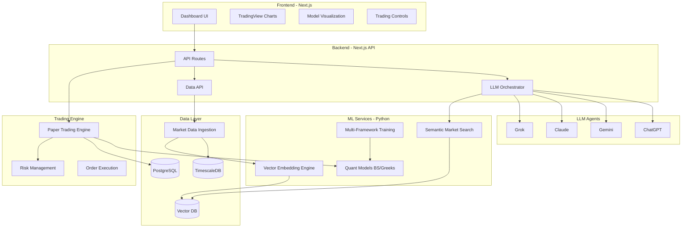

# AI Quantitative Trading Lab

## Architecture Overview



## Tech Stack

### Frontend (Deployable to Vercel)

- **Framework**: Next.js 14 (App Router) with TypeScript
- **UI**: shadcn/ui + Tailwind CSS for modern, responsive design
- **Charts**: Lightweight Charts (TradingView library) for candlesticks, indicators
- **State**: Zustand for client state, React Query for server state
- **Real-time**: WebSocket connection for live updates

### Backend API (Vercel Serverless Functions)

- **API Routes**: Next.js API routes (Edge runtime where possible)
- **Validation**: Zod for type-safe API contracts
- **LLM Integration**: Vercel AI SDK for unified LLM access

### Python ML/Quant Services

- **Framework**: FastAPI for microservices
- **ML Frameworks**: 
  - PyTorch for deep learning models
  - TensorFlow for alternative implementations
  - scikit-learn for classical ML
  - XGBoost/LightGBM for gradient boosting
- **Quant Libraries**:
  - `numpy`/`scipy` for numerical computing
  - `quantlib-python` for Black-Scholes, Greeks, options pricing
  - `pandas-ta` for technical indicators
  - `ta-lib` for traditional TA
- **Embedding**: `sentence-transformers` for encoding market trends
- **Vector Search**: `chromadb` (embedded) or Pinecone (cloud)

### Data Layer

- **Primary DB**: Vercel Postgres (PostgreSQL with TimescaleDB extension)
- **Vector Store**: ChromaDB (self-hosted) or Pinecone (managed)
- **Market Data**: 
  - `yfinance` (Yahoo Finance - free)
  - `alpha_vantage` (free tier)
  - `pandas-datareader`

### Infrastructure

- **Frontend/API**: Vercel deployment
- **ML Services**: Docker containers on Railway/Render (free tier) or Vercel serverless Python
- **Development**: Docker Compose for local orchestration

## Core Innovations

### 1. Semantic Market Search Engine

**Concept**: Encode market conditions (price action, volume, volatility, correlations) into vector embeddings, then semantic search historical data to find similar market regimes.

**Implementation**:

1. **Market State Encoder**: Transform OHLCV + indicators into fixed-length vectors

   - Technical indicators: RSI, MACD, Bollinger Bands, ATR
   - Market regime: volatility cluster, trend strength, correlation matrix
   - Sentiment: VIX, put/call ratios, news sentiment

2. **Historical Database**: 10-15 years of daily/hourly market states encoded as vectors

3. **Semantic Search**: Query current market state → retrieve top-k similar historical periods → analyze outcomes
```python
# Pseudocode
current_state = encode_market_state(recent_prices, indicators, sentiment)
similar_periods = vector_db.search(current_state, top_k=50)
outcomes = analyze_outcomes(similar_periods, forward_window=20)  # next 20 days
prediction = aggregate_outcomes(outcomes)
```


### 2. Multi-LLM Trading Council

**Concept**: Multiple LLM agents analyze market data, semantic search results, and quant signals to make trading decisions. Ensemble voting or debate mechanism.

**Agents**:

- **Analyst Agent (GPT-4)**: Fundamental analysis, news interpretation
- **Technical Agent (Claude)**: Chart pattern recognition, technical signals
- **Risk Agent (Gemini)**: Position sizing, risk assessment
- **Quant Agent (Grok)**: Statistical arbitrage, mean reversion signals

Each agent receives:

- Current market data
- Semantic search results (similar historical periods + outcomes)
- Classical quant signals (Black-Scholes, Greeks, volatility)
- Current portfolio state

### 3. Classical Quant Integration

**Models to implement**:

- **Black-Scholes**: Options pricing, implied volatility
- **Greeks**: Delta, Gamma, Vega, Theta, Rho hedging
- **Statistical Arbitrage**: Pairs trading, cointegration
- **Mean Reversion**: Bollinger Band strategies, z-score
- **Momentum**: Trend following, breakout detection
- **Risk Metrics**: Sharpe, Sortino, max drawdown, VaR

## Project Structure

```
qf/
├── frontend/                 # Next.js app
│   ├── app/                 # App router
│   │   ├── page.tsx        # Dashboard
│   │   ├── models/         # Model management
│   │   ├── backtest/       # Backtesting interface
│   │   ├── trades/         # Trade history
│   │   └── api/            # API routes
│   ├── components/         # React components
│   ├── lib/                # Utils, hooks
│   └── types/              # TypeScript types
│
├── python/                  # Python ML/Quant services
│   ├── api/                # FastAPI endpoints
│   ├── models/             # ML model implementations
│   │   ├── pytorch/       # PyTorch models
│   │   ├── tensorflow/    # TF models
│   │   └── sklearn/       # Classical ML
│   ├── quant/              # Quantitative models
│   │   ├── black_scholes.py
│   │   ├── greeks.py
│   │   ├── indicators.py
│   │   └── risk_metrics.py
│   ├── data/               # Data ingestion & processing
│   │   ├── ingest.py      # Market data fetching
│   │   ├── preprocess.py  # Data cleaning
│   │   └── features.py    # Feature engineering
│   ├── embeddings/         # Vector embedding engine
│   │   ├── encoder.py     # Market state encoder
│   │   ├── vector_db.py   # Vector database interface
│   │   └── search.py      # Semantic search
│   ├── trading/            # Trading engine
│   │   ├── paper_trader.py
│   │   ├── backtest.py
│   │   └── risk_manager.py
│   └── agents/             # LLM agents
│       ├── orchestrator.py
│       ├── analyst.py
│       ├── technical.py
│       └── risk.py
│
├── database/               # Database migrations & schemas
│   ├── migrations/
│   └── schema.sql
│
├── docker/                 # Docker configurations
│   ├── Dockerfile.frontend
│   ├── Dockerfile.python
│   └── docker-compose.yml
│
├── notebooks/              # Jupyter notebooks for research
│   ├── data_exploration.ipynb
│   ├── model_training.ipynb
│   └── backtesting.ipynb
│
├── tests/
└── docs/
```

## Implementation Phases

### Phase 1: Foundation & Data Infrastructure

1. **Project Setup**: Initialize Next.js app with TypeScript, Tailwind, shadcn/ui
2. **Database Schema**: Design tables for trades, positions, market_data, model_runs
3. **Data Ingestion**: Build pipeline to fetch & store historical data (10-15 years)

   - Daily OHLCV for S&P 500 stocks
   - Index data (SPY, QQQ, VIX)
   - Technical indicators calculation

4. **Basic UI**: Dashboard with market data visualization

### Phase 2: Semantic Search Engine

1. **Market State Encoder**: 

   - Feature engineering: 50+ technical indicators
   - Encode market state into 512-dim vectors (transformer-based or custom MLP)

2. **Vector Database Setup**: ChromaDB with 10 years of daily market states
3. **Semantic Search API**: Query interface to find similar historical periods
4. **UI Integration**: Display similar periods and their outcomes

### Phase 3: Classical Quant Models

1. **Black-Scholes Implementation**: Options pricing calculator
2. **Greeks Calculator**: Real-time Greeks for options positions
3. **Technical Indicators**: Moving averages, RSI, MACD, Bollinger Bands
4. **Risk Metrics**: Sharpe ratio, volatility, max drawdown, VaR
5. **Signal Generation**: Buy/sell signals from quant models

### Phase 4: LLM Agent System

1. **LLM Integration**: Connect to OpenAI, Anthropic, Google, xAI APIs
2. **Agent Framework**: Build multi-agent orchestrator with LangChain
3. **Prompt Engineering**: Design prompts for each agent role
4. **Consensus Mechanism**: Voting or debate system for final decisions
5. **UI for Agent Insights**: Display each agent's reasoning and recommendation

### Phase 5: Paper Trading Engine

1. **Order Management**: Market/limit/stop orders
2. **Position Tracking**: Real-time P&L calculation
3. **Risk Management**: Position sizing, stop losses, portfolio limits
4. **Event Loop**: Process market data → agents decide → execute trades
5. **Performance Analytics**: Track strategy performance over time

### Phase 6: ML Model Training Framework

1. **Data Pipeline**: Train/val/test split, data loaders
2. **Model Zoo**: Implement models in PyTorch, TensorFlow, scikit-learn

   - LSTM for time series prediction
   - Transformer for sequence modeling
   - Reinforcement learning (PPO, DQN) for trading agents
   - Gradient boosting for classification

3. **Training Infrastructure**: Experiment tracking, hyperparameter tuning
4. **Model Registry**: Store and version trained models
5. **UI for Model Management**: Upload, evaluate, deploy models

### Phase 7: Advanced Features

1. **Backtesting Engine**: Historical simulation with realistic slippage/fees
2. **Portfolio Optimization**: Mean-variance, risk parity, Kelly criterion
3. **Live Data Feeds**: WebSocket connections for real-time quotes
4. **Alert System**: Notifications for signals, risk events
5. **Strategy Builder**: Visual editor for combining signals

### Phase 8: Production Readiness

1. **Vercel Deployment**: Frontend + API routes
2. **Python Service Deployment**: Docker containers on Railway/Render
3. **Monitoring**: Logging, error tracking, performance metrics
4. **Documentation**: API docs, user guide, model descriptions
5. **Live Trading Prep**: Broker integration (Alpaca, Interactive Brokers)

## Key Technical Decisions

### Market State Encoding Strategy

**Option 1 (Recommended)**: Pretrained embeddings + fine-tuning

- Use sentence-transformers architecture
- Train on historical market states + outcomes
- 512-dim vectors capturing technical + fundamental + sentiment

**Option 2**: Custom CNN/Transformer

- Encode candlestick charts as images → CNN
- Or treat OHLCV as sequences → Transformer
- More flexible but requires more training data

### Vector Database

**For Vercel deployment**:

- Pinecone (managed, $70/mo for 10M vectors) 
- Or Supabase with pgvector extension (cheaper but less optimized)

**For self-hosted**:

- ChromaDB (simple, embedded, free)
- Qdrant (more features, Docker deployment)

### LLM Agent Architecture

**Option 1**: LangChain with ReAct pattern (Recommended)

- Agents have tools: search_similar_periods, calculate_greeks, get_market_data
- Reasoning loop: thought → action → observation → repeat
- Final answer: buy/sell/hold with confidence

**Option 2**: Custom prompt chaining

- Simpler, more control, less overhead
- Sequential: context → analysis → decision

### Python Service Deployment on Vercel

Vercel supports Python serverless functions but with limitations:

- 50MB max function size
- 10s execution timeout (Hobby), 300s (Pro)

**Strategy**:

- Lightweight endpoints in Vercel Python functions (simple quant calcs, API proxies)
- Heavy ML/embedding work in separate FastAPI service (Railway/Render)
- Communication via REST API or message queue

## Estimated Resource Requirements

### Data Storage

- Historical data: ~5-10 GB (10 years, 500 stocks, daily)
- Vector embeddings: ~2 GB (10 years × 252 days × 512 dims × 4 bytes)
- Trade data: < 1 GB

### Compute

- Data ingestion: One-time bulk load, then daily updates
- Embedding generation: One-time for historical, then incremental
- ML training: GPU recommended (Colab free tier, Paperspace, or local)
- Inference: CPU sufficient for real-time trading
- LLM API costs: ~$0.01-0.10 per trading decision (depending on model)

## Next Steps

Once you approve this plan, we'll start with Phase 1:

1. Initialize Next.js project with all necessary dependencies
2. Set up database schema (Vercel Postgres or local PostgreSQL)
3. Create Python FastAPI service structure
4. Build data ingestion pipeline to fetch 10+ years of market data
5. Create basic dashboard UI to visualize data

Let me know if you'd like to adjust any architectural decisions or if you have specific preferences for certain technologies!